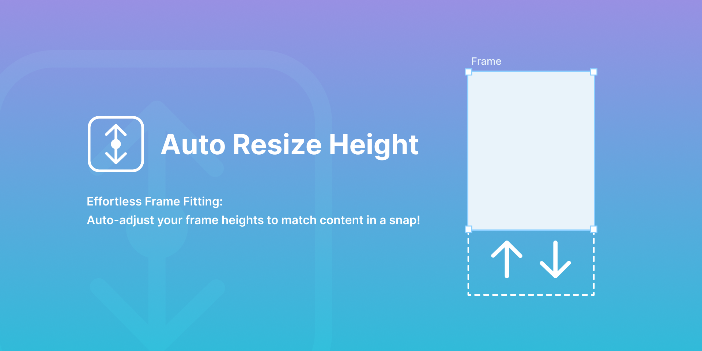

# Auto Resize Height

Effortlessly sync your frame heights with the content inside! Auto Resize Frame is a powerful plugin that automatically adjusts the height of selected frames based on the objects within them, streamlining the layout optimization process and improving the overall design experience.

This is a Figma plugin. Please use the following link. 
https://www.figma.com/community/plugin/1222268664029154882

## Features

- Automatically resize the height of selected frames, components or instances to fit the objects inside
- Keep the top edge of the frame fixed while resizing
- Display an error message if no frames are selected

## How to use

1. Select the frames　(or components or instances) you want to resize
2. Activate the Auto Resize Frame plugin
3. If no frames are selected, a brief error message stating "Please select at least one Frame" will appear at the bottom center of the Figma app screen

Save time and maintain consistency in your projects with the user-friendly and efficient Auto Resize Frame plugin!
